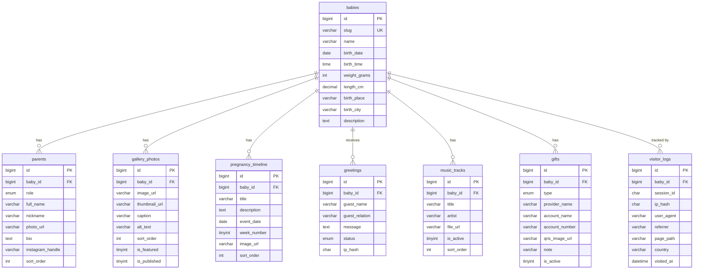

# Desain Database — Filomena

Database MariaDB untuk website kelahiran Filomena. Satu tabel pusat `babies`
menjadi induk, dan tujuh tabel fitur merujuk padanya melalui `baby_id`
(relasi one-to-many). Skema dinormalisasi sampai **3NF**.

- Engine: **InnoDB** (mendukung foreign key & transaksi)
- Charset: **utf8mb4 / utf8mb4_unicode_ci** (mendukung penuh unicode + emoji)
- DDL: [`database/init/02-schema.sql`](../database/init/02-schema.sql)
- Seed: [`database/init/03-seed.sql`](../database/init/03-seed.sql)

## ERD

## Relasi Tabel

| Dari    | Ke                   | Kardinalitas | Aksi FK              |
|---------|----------------------|--------------|----------------------|
| babies  | parents              | 1 : N        | ON DELETE CASCADE    |
| babies  | gallery_photos       | 1 : N        | ON DELETE CASCADE    |
| babies  | pregnancy_timeline   | 1 : N        | ON DELETE CASCADE    |
| babies  | greetings            | 1 : N        | ON DELETE CASCADE    |
| babies  | music_tracks         | 1 : N        | ON DELETE CASCADE    |
| babies  | gifts                | 1 : N        | ON DELETE CASCADE    |
| babies  | visitor_logs         | 1 : N        | ON DELETE CASCADE    |

Semua child memakai `ON DELETE CASCADE`: bila profil bayi dihapus, seluruh
foto, timeline, ucapan, musik, gift, dan log ikut terhapus secara otomatis.

## Penjelasan Tiap Tabel

### 1. `babies` — Informasi Bayi
Profil utama dan induk dari semua tabel lain. `weight_grams` disimpan dalam
gram (INT) agar atomik dan bebas masalah pembulatan float; `length_cm`
memakai DECIMAL(4,1). `birth_place` (rumah sakit) dan `birth_city` dipisah agar
masing-masing menjadi atribut tunggal. `slug` unik dipakai sebagai identitas URL
publik (mis. `/filomena`).

### 2. `parents` — Data Orang Tua
Profil ayah/ibu/wali. Kolom `role` (ENUM) membedakan peran. Dipisah dari
`babies` karena satu bayi punya banyak orang tua (1:N) — menaruh data dua orang
tua di tabel `babies` akan menciptakan kolom berulang (mother_name, father_name,
dst.) yang melanggar 1NF.

### 3. `gallery_photos` — Gallery Foto
Setiap baris adalah satu foto. `sort_order` mengatur urutan tampil,
`is_featured` menandai foto unggulan, `is_published` untuk sembunyikan tanpa
hapus. `thumbnail_url` opsional untuk versi kecil.

### 4. `pregnancy_timeline` — Timeline Perjalanan Kehamilan
Tiap baris satu momen (mis. "USG pertama"). `week_number` (1–42) menyimpan
minggu kehamilan, `event_date` tanggalnya, `sort_order` urutannya.

### 5. `greetings` — Ucapan dan Doa Pengunjung
Pesan dari pengunjung. `status` (ENUM pending/approved/rejected) untuk moderasi
sebelum tampil publik. `ip_hash` menyimpan hash IP (bukan IP mentah) demi privasi
dan anti-spam. `guest_relation` opsional, mis. "Teman Mama".

### 6. `music_tracks` — Musik Background
Daftar lagu latar. `is_active` menandai track yang sedang diputar; `file_url`
menunjuk ke berkas audio. Aturan "hanya satu aktif per bayi" ditegakkan di
level aplikasi (MariaDB tidak punya partial unique index).

### 7. `gifts` — Data Gift / QRIS
Metode pemberian hadiah. `type` (ENUM qris/bank_transfer/e_wallet) menentukan
jenis; `provider_name` (BCA, GoPay, QRIS, …), `account_name`, `account_number`,
dan `qris_image_url` menampung detail sesuai jenisnya. `is_active` &
`sort_order` mengatur tampil/urutan.

### 8. `visitor_logs` — Statistik Pengunjung
Log mentah tiap kunjungan — menjadi *single source of truth* statistik.
`session_id` (UUID) untuk menghitung pengunjung unik, `ip_hash` untuk privasi.
Agregasi tidak disimpan sebagai kolom (itu data turunan yang melanggar 3NF);
sebagai gantinya disediakan VIEW `v_visitor_daily_stats` yang menghitung
total view & sesi unik per hari secara on-the-fly.

## Kepatuhan Normalisasi (hingga 3NF)

**1NF — atomik, tanpa grup berulang.** Setiap kolom menyimpan satu nilai.
Foto, orang tua, dan ucapan yang berjumlah banyak dipindah ke tabelnya sendiri,
bukan kolom berulang seperti `photo1, photo2, photo3`. Berat dipecah ke satuan
gram tunggal, lokasi dipecah jadi `birth_place` + `birth_city`.

**2NF — tanpa partial dependency.** Setiap tabel memakai primary key tunggal
(`id` surrogate `BIGINT AUTO_INCREMENT`), sehingga tidak ada kunci komposit dan
secara otomatis tidak ada ketergantungan pada sebagian kunci.

**3NF — tanpa transitive dependency.** Setiap atribut non-kunci hanya bergantung
pada primary key, bukan pada atribut non-kunci lain. Contoh keputusan desain:
- Pada `gifts` disimpan `provider_name` saja, bukan pasangan `bank_code` +
  `bank_name` (yang akan membuat name bergantung pada code → transitif).
- Pada `visitor_logs` disimpan `country` saja, bukan `country_code` +
  `country_name` sekaligus.
- Statistik harian **tidak** disimpan sebagai kolom di `babies` atau
  `visitor_logs`; ia dihitung lewat VIEW karena merupakan data turunan.

Catatan: VIEW `v_visitor_daily_stats` adalah hasil agregasi (turunan), bukan
tabel tersimpan, sehingga tidak melanggar normalisasi. Jika nanti volume
kunjungan sangat besar dan butuh tabel ringkasan demi performa, itu adalah
*denormalisasi sengaja* untuk optimasi dan sebaiknya didokumentasikan terpisah.
